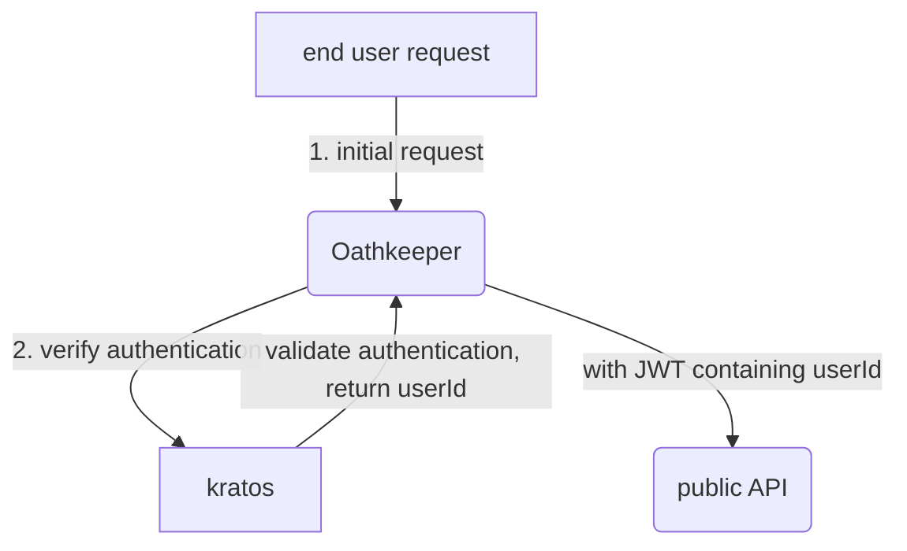
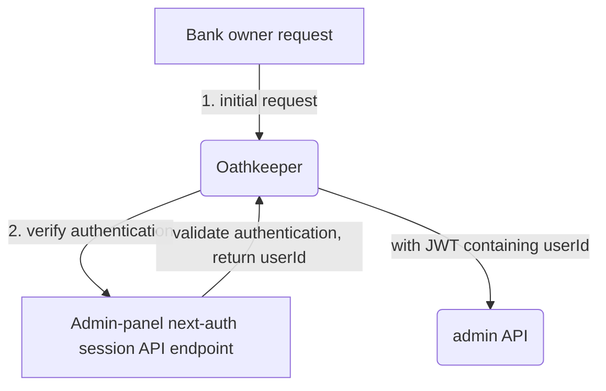

flow to access in dev mode the public API

```mermaid
flowchart TD
    A[end user request] -->|1. initial request| B(Oathkeeper)
    B -->|2. verify authentication| C[kratos]
    C -->|validate authentication, return userId| B
    B -->|with JWT containing userId| D(public API)
```

flow to access in dev mode the admin API

```mermaid
flowchart TD
    A[Bank owner request] -->|1. initial request| B(Oathkeeper)
    B -->|2. verify authentication| C[Admin-panel next-auth session API endpoint]
    C -->|validate authentication, return userId| B
    B -->|with JWT containing userId| D(admin API)
```
