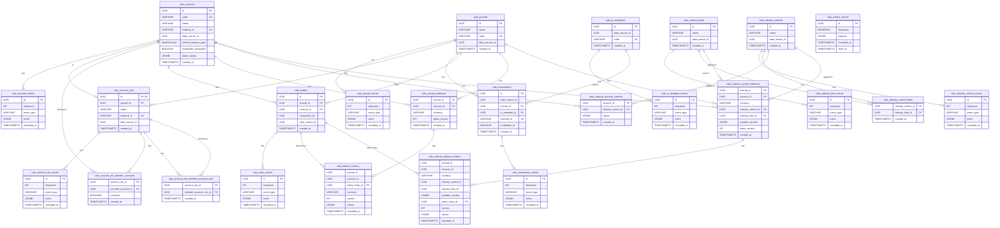

# Cala Ledger ERD

```mermaid
erDiagram
    cala_accounts {
        UUID id PK
        VARCHAR code UK
        VARCHAR name
        VARCHAR external_id UK
        UUID data_source_id
        DebitOrCredit normal_balance_type
        BOOLEAN eventually_consistent
        JSONB latest_values
        TIMESTAMPTZ created_at
    }

    cala_account_events {
        UUID id FK
        INT sequence
        VARCHAR event_type
        JSONB event
        TIMESTAMPTZ recorded_at
    }

    cala_journals {
        UUID id PK
        VARCHAR name
        VARCHAR code UK
        UUID data_source_id
        TIMESTAMPTZ created_at
    }

    cala_journal_events {
        UUID id FK
        INT sequence
        VARCHAR event_type
        JSONB event
        TIMESTAMPTZ recorded_at
    }

    cala_account_sets {
        UUID id PK,FK
        UUID journal_id FK
        VARCHAR name
        VARCHAR external_id UK
        UUID data_source_id
        TIMESTAMPTZ created_at
    }

    cala_account_set_events {
        UUID id FK
        INT sequence
        VARCHAR event_type
        JSONB event
        TIMESTAMPTZ recorded_at
    }

    cala_account_set_member_accounts {
        UUID account_set_id FK
        UUID member_account_id FK
        BOOLEAN transitive
        TIMESTAMPTZ created_at
    }

    cala_account_set_member_account_sets {
        UUID account_set_id FK
        UUID member_account_set_id FK
        TIMESTAMPTZ created_at
    }

    cala_tx_templates {
        UUID id PK
        UUID data_source_id
        VARCHAR code UK
        TIMESTAMPTZ created_at
    }

    cala_tx_template_events {
        UUID id FK
        INT sequence
        VARCHAR event_type
        JSONB event
        TIMESTAMPTZ recorded_at
    }

    cala_transactions {
        UUID id PK
        UUID data_source_id
        UUID journal_id FK
        UUID tx_template_id FK
        VARCHAR external_id UK
        VARCHAR correlation_id
        TIMESTAMPTZ created_at
    }

    cala_transaction_events {
        UUID id FK
        INT sequence
        VARCHAR event_type
        JSONB event
        TIMESTAMPTZ recorded_at
    }

    cala_entries {
        UUID id PK
        UUID journal_id FK
        UUID account_id FK
        UUID transaction_id
        UUID data_source_id
        TIMESTAMPTZ created_at
    }

    cala_entry_events {
        UUID id FK
        INT sequence
        VARCHAR event_type
        JSONB event
        TIMESTAMPTZ recorded_at
    }

    cala_current_balances {
        UUID journal_id FK
        UUID account_id FK
        VARCHAR currency
        INT latest_version
        TIMESTAMPTZ created_at
    }

    cala_balance_history {
        UUID journal_id
        UUID account_id
        UUID latest_entry_id FK
        VARCHAR currency
        INT version
        JSONB values
        TIMESTAMPTZ recorded_at
    }

    cala_velocity_limits {
        UUID id PK
        VARCHAR name
        UUID data_source_id
        TIMESTAMPTZ created_at
    }

    cala_velocity_limit_events {
        UUID id FK
        INT sequence
        VARCHAR event_type
        JSONB event
        TIMESTAMPTZ recorded_at
    }

    cala_velocity_controls {
        UUID id PK
        VARCHAR name
        UUID data_source_id
        TIMESTAMPTZ created_at
    }

    cala_velocity_control_events {
        UUID id FK
        INT sequence
        VARCHAR event_type
        JSONB event
        TIMESTAMPTZ recorded_at
    }

    cala_velocity_control_limits {
        UUID velocity_control_id FK
        UUID velocity_limit_id FK
        TIMESTAMPTZ created_at
    }

    cala_velocity_account_controls {
        UUID account_id FK
        UUID velocity_control_id FK
        JSONB values
        TIMESTAMPTZ created_at
    }

    cala_velocity_current_balances {
        UUID journal_id FK
        UUID account_id FK
        VARCHAR currency
        UUID velocity_control_id FK
        UUID velocity_limit_id FK
        JSONB partition_window
        INT latest_version
        TIMESTAMPTZ created_at
    }

    cala_velocity_balance_history {
        UUID journal_id
        UUID account_id
        VARCHAR currency
        UUID velocity_control_id
        UUID velocity_limit_id
        JSONB partition_window
        UUID latest_entry_id FK
        INT version
        JSONB values
        TIMESTAMPTZ recorded_at
    }

    cala_outbox_events {
        UUID id PK
        BIGSERIAL sequence
        JSONB payload
        TIMESTAMPTZ recorded_at
        TIMESTAMPTZ seen_at
    }

    %% Relationships
    cala_accounts ||--o{ cala_account_events : "has"
    cala_journals ||--o{ cala_journal_events : "has"
    cala_accounts ||--o| cala_account_sets : "is"
    cala_journals ||--o{ cala_account_sets : "has"
    cala_account_sets ||--o{ cala_account_set_events : "has"
    cala_account_sets ||--o{ cala_account_set_member_accounts : "has"
    cala_accounts ||--o{ cala_account_set_member_accounts : "belongs to"
    cala_account_sets ||--o{ cala_account_set_member_account_sets : "has"
    cala_account_sets ||--o{ cala_account_set_member_account_sets : "belongs to"
    cala_tx_templates ||--o{ cala_tx_template_events : "has"
    cala_journals ||--o{ cala_transactions : "has"
    cala_tx_templates ||--o{ cala_transactions : "used in"
    cala_transactions ||--o{ cala_transaction_events : "has"
    cala_journals ||--o{ cala_entries : "has"
    cala_accounts ||--o{ cala_entries : "has"
    cala_entries ||--o{ cala_entry_events : "has"
    cala_journals ||--o{ cala_current_balances : "has"
    cala_accounts ||--o{ cala_current_balances : "has"
    cala_current_balances ||--o{ cala_balance_history : "has"
    cala_entries ||--o{ cala_balance_history : "latest entry"
    cala_velocity_limits ||--o{ cala_velocity_limit_events : "has"
    cala_velocity_controls ||--o{ cala_velocity_control_events : "has"
    cala_velocity_controls ||--o{ cala_velocity_control_limits : "has"
    cala_velocity_limits ||--o{ cala_velocity_control_limits : "used in"
    cala_accounts ||--o{ cala_velocity_account_controls : "has"
    cala_velocity_controls ||--o{ cala_velocity_account_controls : "applied to"
    cala_journals ||--o{ cala_velocity_current_balances : "has"
    cala_accounts ||--o{ cala_velocity_current_balances : "has"
    cala_velocity_controls ||--o{ cala_velocity_current_balances : "applied to"
    cala_velocity_limits ||--o{ cala_velocity_current_balances : "applied to"
    cala_velocity_current_balances ||--o{ cala_velocity_balance_history : "has"
    cala_entries ||--o{ cala_velocity_balance_history : "latest entry"
```