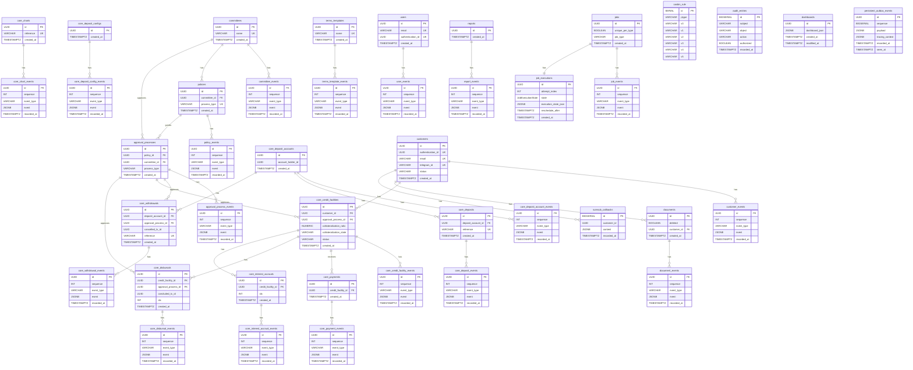

# Lana Core ERD

```mermaid
erDiagram
    committees {
        UUID id PK
        VARCHAR name UK
        TIMESTAMPTZ created_at
    }

    committee_events {
        UUID id FK
        INT sequence
        VARCHAR event_type
        JSONB event
        TIMESTAMPTZ recorded_at
    }

    policies {
        UUID id PK
        UUID committee_id FK
        VARCHAR process_type UK
        TIMESTAMPTZ created_at
    }

    policy_events {
        UUID id FK
        INT sequence
        VARCHAR event_type
        JSONB event
        TIMESTAMPTZ recorded_at
    }

    approval_processes {
        UUID id PK
        UUID policy_id FK
        UUID committee_id FK
        VARCHAR process_type
        TIMESTAMPTZ created_at
    }

    approval_process_events {
        UUID id FK
        INT sequence
        VARCHAR event_type
        JSONB event
        TIMESTAMPTZ recorded_at
    }

    core_charts {
        UUID id PK
        VARCHAR reference UK
        TIMESTAMPTZ created_at
    }

    core_chart_events {
        UUID id FK
        INT sequence
        VARCHAR event_type
        JSONB event
        TIMESTAMPTZ recorded_at
    }

    core_deposit_configs {
        UUID id PK
        TIMESTAMPTZ created_at
    }

    core_deposit_config_events {
        UUID id FK
        INT sequence
        VARCHAR event_type
        JSONB event
        TIMESTAMPTZ recorded_at
    }

    core_deposit_accounts {
        UUID id PK
        UUID account_holder_id
        TIMESTAMPTZ created_at
    }

    core_deposit_account_events {
        UUID id FK
        INT sequence
        VARCHAR event_type
        JSONB event
        TIMESTAMPTZ recorded_at
    }

    core_deposits {
        UUID id PK
        UUID deposit_account_id FK
        VARCHAR reference UK
        TIMESTAMPTZ created_at
    }

    core_deposit_events {
        UUID id FK
        INT sequence
        VARCHAR event_type
        JSONB event
        TIMESTAMPTZ recorded_at
    }

    core_withdrawals {
        UUID id PK
        UUID deposit_account_id FK
        UUID approval_process_id FK
        UUID cancelled_tx_id
        VARCHAR reference UK
        TIMESTAMPTZ created_at
    }

    core_withdrawal_events {
        UUID id FK
        INT sequence
        VARCHAR event_type
        JSONB event
        TIMESTAMPTZ recorded_at
    }

    customers {
        UUID id PK
        UUID authentication_id UK
        VARCHAR email UK
        VARCHAR telegram_id UK
        VARCHAR status
        TIMESTAMPTZ created_at
    }

    customer_events {
        UUID id FK
        INT sequence
        VARCHAR event_type
        JSONB event
        TIMESTAMPTZ recorded_at
    }

    terms_templates {
        UUID id PK
        VARCHAR name UK
        TIMESTAMPTZ created_at
    }

    terms_template_events {
        UUID id FK
        INT sequence
        VARCHAR event_type
        JSONB event
        TIMESTAMPTZ recorded_at
    }

    users {
        UUID id PK
        VARCHAR email UK
        UUID authentication_id UK
        TIMESTAMPTZ created_at
    }

    user_events {
        UUID id FK
        INT sequence
        VARCHAR event_type
        JSONB event
        TIMESTAMPTZ recorded_at
    }

    core_credit_facilities {
        UUID id PK
        UUID customer_id FK
        UUID approval_process_id FK
        NUMERIC collateralization_ratio
        VARCHAR collateralization_state
        VARCHAR status
        TIMESTAMPTZ created_at
    }

    core_credit_facility_events {
        UUID id FK
        INT sequence
        VARCHAR event_type
        JSONB event
        TIMESTAMPTZ recorded_at
    }

    core_payments {
        UUID id PK
        UUID credit_facility_id FK
        TIMESTAMPTZ created_at
    }

    core_payment_events {
        UUID id FK
        INT sequence
        VARCHAR event_type
        JSONB event
        TIMESTAMPTZ recorded_at
    }

    core_disbursals {
        UUID id PK
        UUID credit_facility_id FK
        UUID approval_process_id FK
        UUID concluded_tx_id
        INT idx
        TIMESTAMPTZ created_at
    }

    core_disbursal_events {
        UUID id FK
        INT sequence
        VARCHAR event_type
        JSONB event
        TIMESTAMPTZ recorded_at
    }

    core_interest_accruals {
        UUID id PK
        UUID credit_facility_id FK
        INT idx
        TIMESTAMPTZ created_at
    }

    core_interest_accrual_events {
        UUID id FK
        INT sequence
        VARCHAR event_type
        JSONB event
        TIMESTAMPTZ recorded_at
    }

    documents {
        UUID id PK
        BOOLEAN deleted
        UUID customer_id FK
        TIMESTAMPTZ created_at
    }

    document_events {
        UUID id FK
        INT sequence
        VARCHAR event_type
        JSONB event
        TIMESTAMPTZ recorded_at
    }

    reports {
        UUID id PK
        TIMESTAMPTZ created_at
    }

    report_events {
        UUID id FK
        INT sequence
        VARCHAR event_type
        JSONB event
        TIMESTAMPTZ recorded_at
    }

    jobs {
        UUID id PK
        BOOLEAN unique_per_type
        VARCHAR job_type
        TIMESTAMPTZ created_at
    }

    job_events {
        UUID id FK
        INT sequence
        VARCHAR event_type
        JSONB event
        TIMESTAMPTZ recorded_at
    }

    job_executions {
        UUID id FK
        INT attempt_index
        JobExecutionState state
        JSONB execution_state_json
        TIMESTAMPTZ reschedule_after
        TIMESTAMPTZ created_at
    }

    casbin_rule {
        SERIAL id PK
        VARCHAR ptype
        VARCHAR v0
        VARCHAR v1
        VARCHAR v2
        VARCHAR v3
        VARCHAR v4
        VARCHAR v5
    }

    audit_entries {
        BIGSERIAL id PK
        VARCHAR subject
        VARCHAR object
        VARCHAR action
        BOOLEAN authorized
        TIMESTAMPTZ recorded_at
    }

    dashboards {
        UUID id PK
        JSONB dashboard_json
        TIMESTAMPTZ created_at
        TIMESTAMPTZ modified_at
    }

    sumsub_callbacks {
        BIGSERIAL id PK
        UUID customer_id
        JSONB content
        TIMESTAMPTZ recorded_at
    }

    persistent_outbox_events {
        UUID id PK
        BIGSERIAL sequence
        JSONB payload
        JSONB tracing_context
        TIMESTAMPTZ recorded_at
        TIMESTAMPTZ seen_at
    }

    %% Relationships
    committees ||--o{ committee_events : "has"
    committees ||--o{ policies : "has"
    policies ||--o{ policy_events : "has"
    policies ||--o{ approval_processes : "guides"
    committees ||--o{ approval_processes : "approves"
    approval_processes ||--o{ approval_process_events : "has"
    core_charts ||--o{ core_chart_events : "has"
    core_deposit_configs ||--o{ core_deposit_config_events : "has"
    core_deposit_accounts ||--o{ core_deposit_account_events : "has"
    core_deposit_accounts ||--o{ core_deposits : "has"
    core_deposits ||--o{ core_deposit_events : "has"
    core_deposit_accounts ||--o{ core_withdrawals : "has"
    approval_processes ||--o{ core_withdrawals : "approves"
    core_withdrawals ||--o{ core_withdrawal_events : "has"
    customers ||--o{ customer_events : "has"
    terms_templates ||--o{ terms_template_events : "has"
    users ||--o{ user_events : "has"
    customers ||--o{ core_credit_facilities : "has"
    approval_processes ||--o{ core_credit_facilities : "approves"
    core_credit_facilities ||--o{ core_credit_facility_events : "has"
    core_credit_facilities ||--o{ core_payments : "receives"
    core_payments ||--o{ core_payment_events : "has"
    core_credit_facilities ||--o{ core_disbursals : "has"
    approval_processes ||--o{ core_disbursals : "approves"
    core_disbursals ||--o{ core_disbursal_events : "has"
    core_credit_facilities ||--o{ core_interest_accruals : "has"
    core_interest_accruals ||--o{ core_interest_accrual_events : "has"
    customers ||--o{ documents : "has"
    documents ||--o{ document_events : "has"
    reports ||--o{ report_events : "has"
    jobs ||--o{ job_events : "has"
    jobs ||--|| job_executions : "has"
    customers ||--o{ sumsub_callbacks : "has"
```